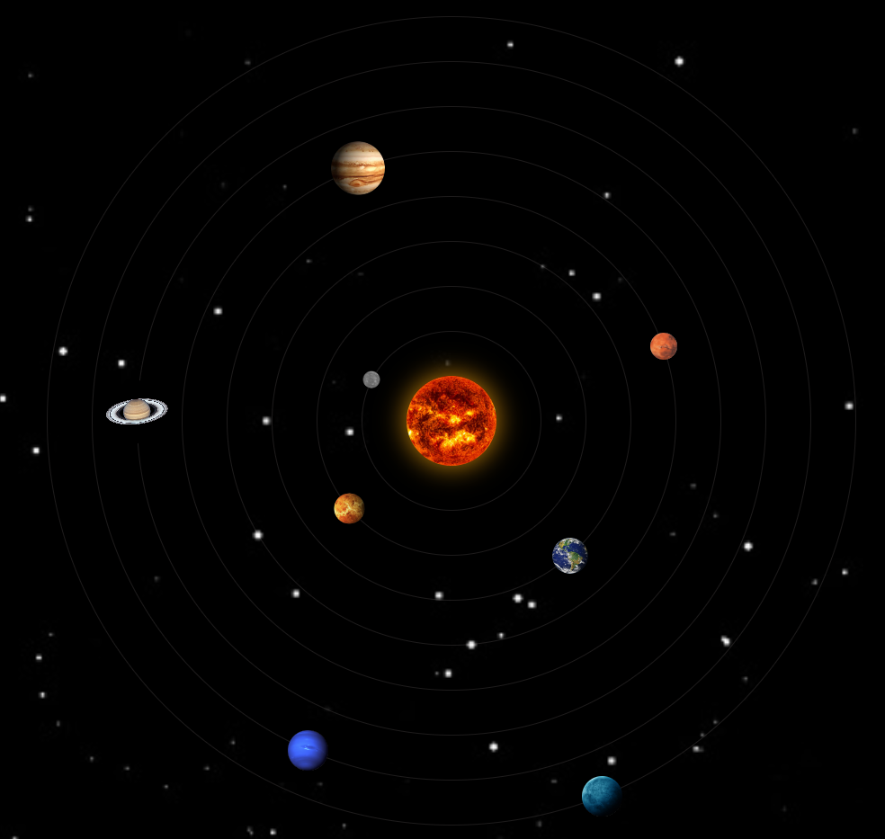

# Solar System

This project is a web-based simulation of the solar system created using HTML, CSS, and JavaScript. It provides an interactive and visually appealing representation of the planets and their orbits around the sun.



## Demo

You can access a live demo of the solar system simulation [here](https://rh-playground.github.io/Solar-System/).

## Features

- **Realistic Visualization**: The solar system is depicted accurately, with planets positioned relative to their size and orbits.
- **Smooth Animations**: The planets move smoothly along their elliptical orbits, creating a realistic simulation.
- **Responsive Design**: The application is responsive.

## Installation

Clone the repository:

   ```bash
   git clone https://github.com/RH-Playground/Solar-System.git

